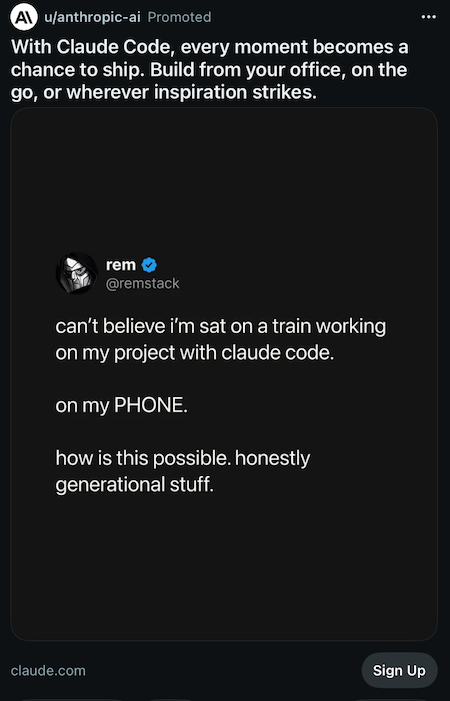

## Hot take: I don't care about 100×ing my workflow

Lately I've been making a lot of videos about cool AI tools. I have been making videos about cool new stuff for 15 years. AI is just the latest one, but a whole new breed of social media hawks have appeared on the scene. Every week there's another video, tweet, or conference talk promising a future where AI gives you a 100× workflow.

- Fully autonomous agents.
- Companies run by one person.
- AI employees.
- Twenty-four-hour digital coworkers.
- "Never touch your keyboard again."

I just don't care and I use AI every day. Constantly. I just think we've become obsessed with optimizing the wrong thing and the hype is exhausting. There's this strange pressure in AI circles to prove you're extracting every possible ounce of productivity.

- If you're still writing code yourself, you're doing it wrong.
- If you review your AI's work, you're slowing yourself down.
- If you're not orchestrating sixteen autonomous agents while you sleep, you're apparently behind.

I don't buy it. The people selling "100× productivity" usually spend a suspicious amount of time making videos about how productive they are and selling course on how you too can be 100× more productive. They usually have no other job. Or software. Meanwhile, I'm over here just trying to build software with new cool tools.

## Agents as Functions

I use agents like functions. This is probably the least exciting way to use AI, but it's worked incredibly well for me. I write tiny agents that take structured input and produce structured output. They do one thing. Then I write another agent that consumes that schema. Or another one that produces it. Before long I've got a pipeline where each piece does one thing well.

For me this is software engineering with LLMs and each agent is predictable. If one breaks, I know where to look. If I want to improve something, I replace one stage instead of rebuilding the whole system. Small pieces. Clear contracts. Boring architecture.

I'll take boring every time.

## Twelve seconds doesn't bother me

Apparently if I pay more money I can get my AI to work faster. Or get 32 agents to run simulaneously. I get it. Faster is nice.

But I also don't mind waiting twelve seconds. The job runs hiwle I switch back to my editor or answer an email or I think about the next feature. Then the result is ready.

The computer is busy so I don't have to be and to me that's the entire point. The alternative perspective puts a lot of value on staring at a loading spinner slightly less and that's just not my goal. Maybe old-fashioned, but I enjoy using my own brainpower on problems that actually deserve it.

## Automation should make work disappear

I don't really want a digital employee working around the clock, but I do have cron jobs. They summarize repositories, collect commits, scrape information, organize notes, and generate reports. When I sit down in the morning, there's a tidy pile of information waiting for me. That's automation I understand. Go gather data while I'm asleep. Don't pretend you're replacing my judgment.

## I don't want to work on the train

This is an actual ad Anthropic runs on reddit:

When I'm on the train, I'd rather look out the window. When I'm with my family, I'd rather be with my family. I don't need an AI assistant whispering business opportunities into my ear while I'm standing in line for coffee.

Not that I was a huge fan of the ping-pong table in the office movement, but holy shit this is a step backwards. How the fuck did we go from demanding mental health days to being happy to work during a commute?

## AI is a tool

That's really what this comes down to. AI is a tool. It's a real tool you can add to your toolbox and it might be a headstart if your toolbox is shallow. And that's it. For me sometimes it's a brainstorming partner, but most of the time it's a grunt.

I don't need AI to replace me, I hope it replaces the boring parts of my job, and that feels like a much healthier relationship.

If that only makes me 20% more productive instead of 100×... I'm perfectly okay with that.
